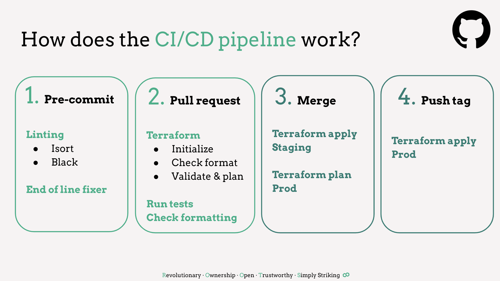

# CI/CD pipeline

The figure above presents the actions performed in every step. Thus, we have the following files:
- `main.yaml` - actions performed in order to deploy to staging (step 3 in figure)
- `pr.yaml` - actions performed in order to check the feature branch before merging to main/master (step 2 in figure)
- `tag.yaml` - actions performed in order to deploy to production (step 4 in figure)

Step 1's actions can be seen in `.pre-commit-config.yaml`
In order to initialize the `pre-commit` [hook]("https://pre-commit.com/"), you need to run `pre-commit install`