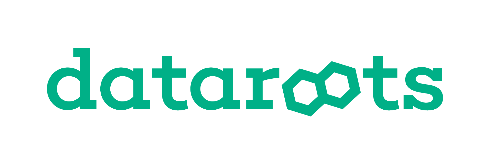
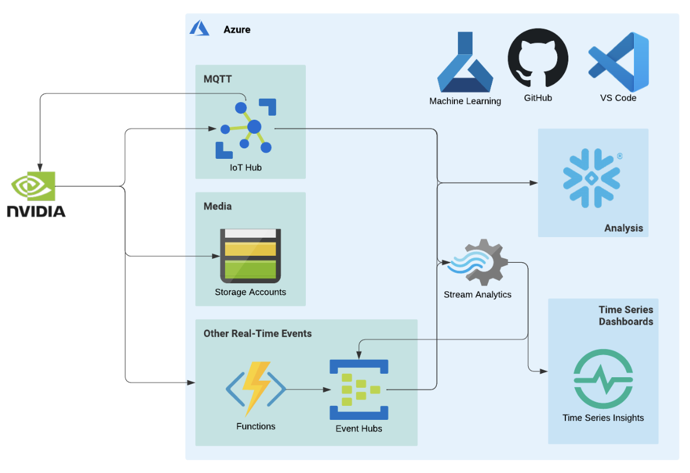

[](https://dataroots.io)



# Terraforming Snowflake 
Part of [Weather Nowcasting](https://dataroots.ghost.io/weather-nowcasting/) - Weather prediction on an NVIDIA jetson with a CI/CD pipeline on the cloud.
Shows how Terraform can be used to set up our Snowflake resources. On top of that, we present how to load in near-real-time the content of an Azure container into a Snowflake table. 

## General
This is part of the graduation project of the rootsacademy of March 2022. An application to predict weather up to 4 hours in the future based on measurements obtained from a sensor installed on the roof of Dataroots' building. These predictions will be based on real-time measurements of the temperature, humidity, pressure, light, sound and a camera pointed towards the sky. We also wanted to exercise building the CI/CD pipeline and connection between the edge device and the cloud.
More information can also be found [here](https://dataroots.io/research/contributions/weather-nowcasting).

## Cloud architecture

Here's an overview of our cloud architecture:
- Provisioning the required resources and environments  
- Managing the flow of sensor data from the edge device into the IoT hub on Azure
- Connecting the IoT endpoint (blob container) to Snowflake using Azure Event Grid
- Managing the flow of images from the device into a blob storage container on Azure and from the storage container into the ML workspace
- Developing a CI/CD pipeline that automates the build and deployment of a model on an edge device




## Resources 

**Snowflake**
- Database
- Warehouse
- Schema
- Tables
  - One for sensor information
  - One for predictions
- File format
- Storage & notification integration
- Pipes (one for each of the tables)
- Stages (one for each of the tables)

**Edge & ML resources:**
- IoT hub, along with its dependencies, e.g. azure container registry
- Storage accounts
  - One for storing the images sent from the IoT device
  - One for storing the sensor data
  - One for storing the predictions
- Machine learning workspace, along with its dependencies, e.g. key vault, application insights


## CI/CD actions
In this project we validate and plan our Terraform code as part of a Github workflow; more specifically, we execute the following 4 steps: 
- _Init_ command: ```terraform init -backend-config backend/staging.tfvars```
- _Format_ command: ```terraform fmt -check -recursive```
- _Validate_ command: ```terraform validate```
- _Plan_ command: ```terraform plan```

The above actions get triggered on a pull-request; whenever the pull-request is reviewed, approved and closed, a new workflow will run and everything gets executed in production: ```terraform apply -var-file vars/prod.tfvars```

## Prerequisites
- [Snowflake](https://www.snowflake.com/) account
- [Azure](https://azure.microsoft.com/en-us/) account

## Getting started
We explain everything in our [blog post](TBD). Briefly, you can do the following:
<ul>
  <li>Find out the Snowflake's account locator and region id</li>
  <li>Create RSA key</li>
  <li>Create service user for authentication to Terraform</li>
  <li>Set up the resources</li>
  <li>Grant access to storage containers</li>
  <li>Verify/apply changes</li>
</ul>

## Acknowledgements
Special thanks go to our supervisors at Dataroots for guiding us throught this project. 

## Contact
- [Lidia](https://github.com/LidiaBaciu) lidia@dataroots.io
- [Bao](https://github.com/dbtruong) bao@dataroots.io
